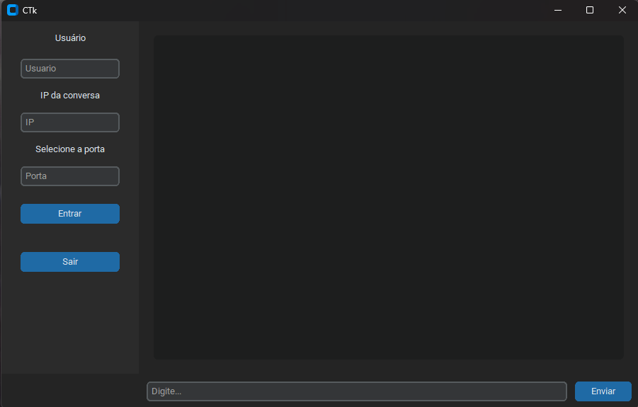

<h1>🛜Chat de Redes IFSC 2026</h1>

<h3>Com base nos conceitos apresentados nas aulas (materia de Redes- IFSC) e utilizando a linguagem de programação de sua 
preferência crie uma aplicação de bate papo (chat) contemplando os seguintes requisitos técnicos: </h3> 
• deve ter interface gráfica (GUI – Graphical User Interface);  
• somente uma aplicação será desenvolvida, sendo esta capaz de enviar e receber mensagens;  
◦ obs.: para o envio e recebimento de mensagens de forma simultânea, a mesma porta de comunicação
pode ser utilizada, porém o envio e recebimento devem ser tratados em threads distintas;  
• a comunicação entre os nós comunicantes deve ser realizada obrigatoriamente via multicast;  
◦ obs.: o padrão multicast exige a utilização do protocolo UDP;  
• a interface gráfica deve permitir ao usuário:  
◦ definir o seu nome de usuário;  
◦ definir o grupo multicast ao qual a aplicação irá entrar;  
◦ definir a porta de comunicação;  
◦ entrar e sair de diferentes grupos sem o fechamento da aplicação;  
▪ obs: a aplicação irá se comunicar (entrar) com apenas 1 grupo por vez;  
• o payload (carga útil) da mensagem deve estar no formato JSON (codificação UTF-8) e seguir
rigorosamente o seguinte layout:  
 
{  
"date":"date_value",  
"time":"time_value",  
"username":"username_value",  
"message":"message_value"  
}  
<h3>Onde:</h3>
date_value é a data (dd/mm/aaaa) de envio da mensagem (obtida no nó origem);  
time_value é a hora (hh:mm:ss) de envio da mensagem (obtida no nó origem);  
username_value é o nome do usuário que enviou a mensagem;  
message_value é a mensagem em si;
